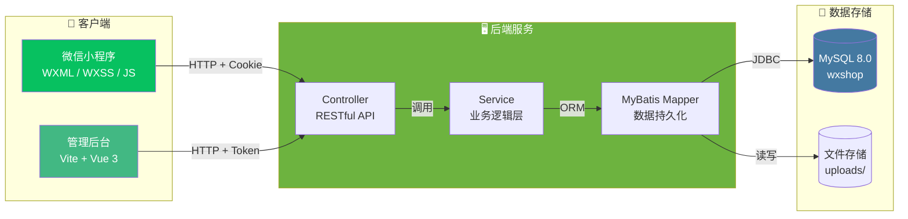
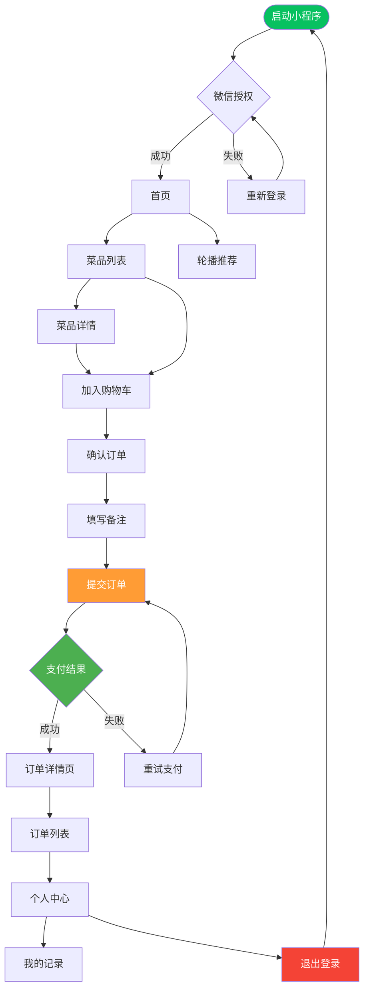
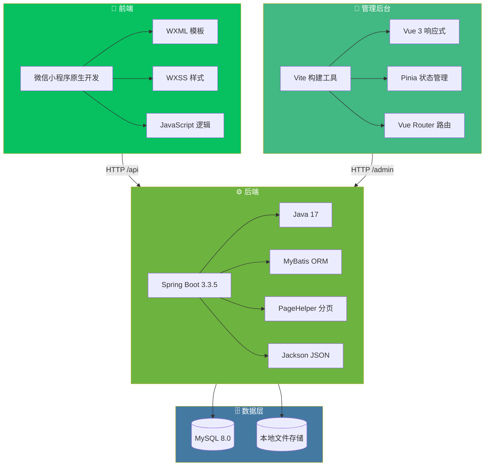
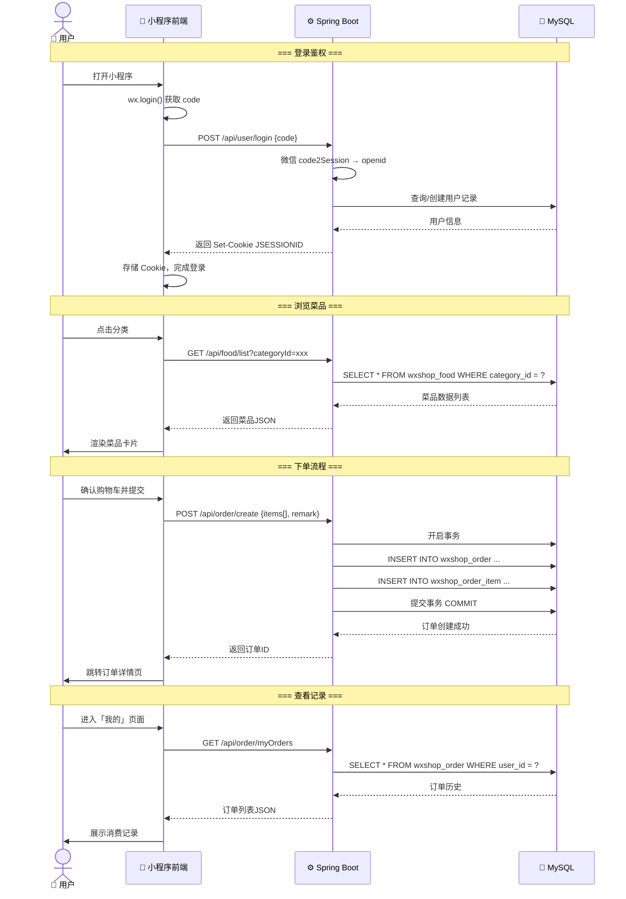

# 🍜 一口食堂 (Yikou Canteen)

基于微信小程序的食堂/餐饮在线点餐系统，支持菜品浏览、购物车下单、订单管理等完整业务流程。

## 🏗 系统架构



## 🔄 业务流程



## 🛠 技术栈



## 📡 API 时序图



## 📂 目录结构

```
mp-weixin/
├── README.md
├── frontend/                        # 微信小程序前端
│   ├── app.js / app.json / app.wxss  # 小程序入口与全局配置
│   ├── utils/
│   │   ├── config.js                # API 请求基础地址
│   │   ├── fetch.js                 # 网络请求封装 (Cookie 会话)
│   │   └── decodeCookie.js          # Cookie 解析工具
│   ├── pages/
│   │   ├── login/                   # 登录页
│   │   ├── index/                   # 首页
│   │   ├── list/                    # 菜品列表页
│   │   ├── order/
│   │   │   ├── checkout/            # 确认下单页
│   │   │   ├── detail/              # 订单详情页
│   │   │   └── list/                # 订单列表页
│   │   └── record/                  # 我的记录页
│   └── images/                      # 图标与静态资源
└── backend/
    └── shop-springboot/             # Spring Boot 后端
        ├── pom.xml                  # Maven 项目配置
        ├── src/main/java/fun/xingji/wxshop/
        │   ├── controller/          # 控制器层
        │   ├── service/             # 服务层
        │   ├── mapper/              # MyBatis Mapper 接口
        │   ├── entity/              # 实体类
        │   ├── config/              # 配置类
        │   └── util/                # 工具类
        └── admin-ui/                # Vite+Vue 管理后台
```

## 🚀 快速开始

### 1. 前端（微信小程序）

1. 下载并安装 [微信开发者工具](https://developers.weixin.qq.com/miniprogram/dev/devtools/download.html)
2. 将 `frontend/` 目录导入开发者工具
3. 修改 `frontend/utils/config.js` 中的 `baseUrl` 为你的后端地址
4. 在开发者工具中填写你的小程序 AppID，即可预览运行

### 2. 后端（Spring Boot）

**环境要求：**
- JDK 17+
- Maven 3.6+
- MySQL 8.0+

**启动步骤：**

```bash
# 1. 进入后端目录
cd backend/shop-springboot

# 2. 复制并修改配置文件
cp application-example.yml application.yml
# 编辑 application.yml，填入你的 MySQL 密码和微信小程序 AppID/AppSecret

# 3. 创建数据库（MySQL 中执行）
# CREATE DATABASE wxshop DEFAULT CHARACTER SET utf8mb4;

# 4. 编译运行
mvn clean package -DskipTests
java -jar target/wxshop-1.0.0.jar
```

服务默认运行在 `http://localhost:8080`，API 路径前缀为 `/api`。

### 3. 管理后台（可选）

```bash
cd backend/shop-springboot/admin-ui
npm install
npm run dev
```

## ⚠️ 注意事项

1. **安全提醒**：`application.yml` 已加入 `.gitignore`，首次使用需将 `application-example.yml` 重命名为 `application.yml` 并填入真实的数据库密码、微信 AppID 和 AppSecret。
2. **小程序配置**：需在微信公众平台注册小程序，获取 AppID 和 AppSecret。
3. **上传目录**：`uploads/` 目录用于存放菜品图片，请确保该目录有写入权限。

## 📄 License

MIT License
