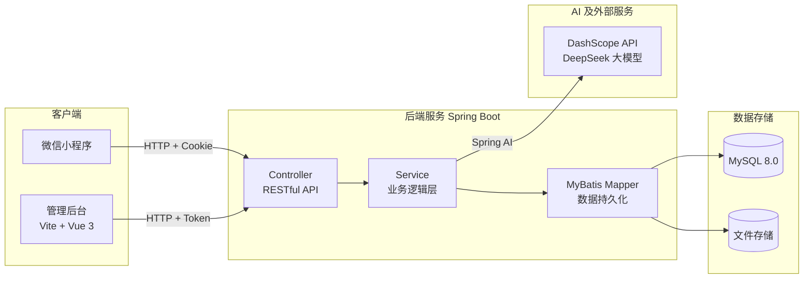
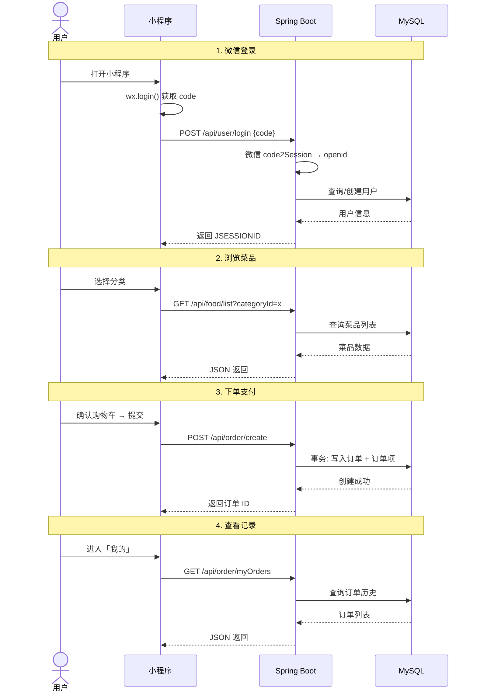

# 🍜 一口食堂

基于微信小程序的食堂/餐饮在线点餐系统，支持菜品浏览、购物车下单、订单管理等完整业务流程。

> **技术栈**：Spring Boot 3.3.5 + Vue 3 + 微信小程序原生 + MySQL 8.0 + Spring AI Alibaba (DeepSeek)

---

## ✨ 功能概览

| 客户端 | 主要功能 |
|---|---|
| **微信小程序** | 微信授权登录、分类浏览菜品、购物车管理、下单/支付、订单追踪、消费记录 |
| **后台管理系统** | 数据仪表盘、菜品/分类 CRUD、订单管理、用户管理、系统设置、AI 智能助手 |

---

## 🏗 系统架构



## 🔄 核心流程



---

## 📂 项目结构

```
mp-weixin/
├── frontend/                          # 微信小程序
│   ├── app.js / app.json / app.wxss    # 入口与全局配置
│   ├── utils/                          # 工具函数 (cookie / fetch / config)
│   ├── pages/
│   │   ├── login/                      # 微信登录
│   │   ├── index/                      # 首页 (分类 + 推荐)
│   │   ├── list/                       # 菜品列表
│   │   ├── order/checkout/             # 确认下单
│   │   ├── order/detail/               # 订单详情
│   │   ├── order/list/                 # 订单列表
│   │   └── record/                     # 消费记录
│   └── images/                         # 图标与静态资源
│
└── backend/shop-springboot/            # Spring Boot 后端
    ├── pom.xml                         # Maven 依赖
    ├── application-example.yml         # 配置模板
    ├── src/main/java/fun/xingji/wxshop/
    │   ├── controller/                 # REST 控制器
    │   ├── service/                    # 业务逻辑
    │   ├── mapper/                     # MyBatis 数据访问
    │   ├── entity/                     # 数据实体
    │   ├── config/                     # 项目配置
    │   ├── util/                       # 工具类
    │   └── ai/                         # AI 智能助手模块
    │       ├── config/AiConfig.java    #   ChatClient Bean 注册
    │       ├── controller/             #   AI API 控制器
    │       ├── service/AiService.java  #   Prompt 工程 + LLM 调用
    │       ├── service/AiDataService.java  # 业务数据聚合
    │       └── dto/                    #   请求/响应 DTO
    ├── src/main/resources/
    │   ├── application.yml             # 应用配置 (需自行创建)
    │   ├── mapper/                     # MyBatis XML 映射
    │   └── static/admin/               # 管理后台静态资源 (构建产物)
    └── admin-ui/                       # 管理后台源码 (Vite + Vue 3)
```

---

## 🤖 AI 智能助手

基于 **Spring AI Alibaba** 集成阿里云 DashScope，调用 DeepSeek 大模型，为店铺管理员提供 4 大 AI 能力：

| 功能 | 说明 | 数据来源 |
|---|---|---|
| **菜品描述生成** | 港式茶餐厅风格，一键生成 15-25 字诱人描述 | 菜品名称/分类/价格 |
| **每日经营简报** | 核心数据 → 环比趋势 → 异常提醒 → 经营建议 | 订单/营收/热销数据 |
| **智能套餐推荐** | 基于 TOP10 高频搭配，推荐 2-3 个套餐（含定价） | 历史订单共现分析 |
| **营销活动参谋** | 输出 2-3 个活动方案（主题/条件/方案/效果） | 店铺设置/满减规则/热销 |

**调用链路**：`AdminAiController → AiService (Prompt 工程) → AiDataService (数据聚合) → ChatClient → DashScope API → DeepSeek`

> API 端点：`/admin/api/ai/*`，需在管理后台「AI 助手」页面使用。

---

## 🚀 快速开始

### 环境要求

| 组件 | 版本 |
|---|---|
| JDK | 17+ |
| Maven | 3.6+ |
| MySQL | 8.0+ |
| Node.js | 18+ (可选，仅管理后台) |

### 1. 后端服务

```bash
# 进入后端目录
cd backend/shop-springboot

# 创建配置文件（填入你的 MySQL 密码、微信 AppID/AppSecret、DashScope API Key）
cp application-example.yml application.yml

# 创建数据库（MySQL 中执行）
# CREATE DATABASE wxshop DEFAULT CHARACTER SET utf8mb4;

# 启动服务
mvn spring-boot:run
# 或者：mvn clean package -DskipTests && java -jar target/wxshop-1.0.0.jar
```

> 服务运行在 `http://localhost:8080`，API 前缀 `/api`，管理后台 `/admin`

### 2. 微信小程序

1. 下载 [微信开发者工具](https://developers.weixin.qq.com/miniprogram/dev/devtools/download.html)
2. 导入 `frontend/` 目录，填写你的 AppID
3. 修改 `frontend/utils/config.js` 中的 `baseUrl` 为后端地址
4. 预览运行

### 3. 管理后台（可选）

```bash
cd backend/shop-springboot/admin-ui
npm install
npm run dev        # 开发模式
npm run build      # 构建并自动复制到 static/admin/
```

---

## ⚠️ 注意事项

- **配置安全**：`application.yml` 已加入 `.gitignore`，首次使用请复制 `application-example.yml` 并修改。
- **小程序资质**：需在 [微信公众平台](https://mp.weixin.qq.com/) 注册小程序，获取 AppID 和 AppSecret。
- **文件上传**：确保 `uploads/` 目录有写入权限，用于存放菜品图片。
- **AI 功能**：需在 [阿里云 DashScope](https://dashscope.aliyun.com/) 申请 API Key 并配置到 `spring.ai.dashscope.api-key`。

---

## 📄 License

MIT
